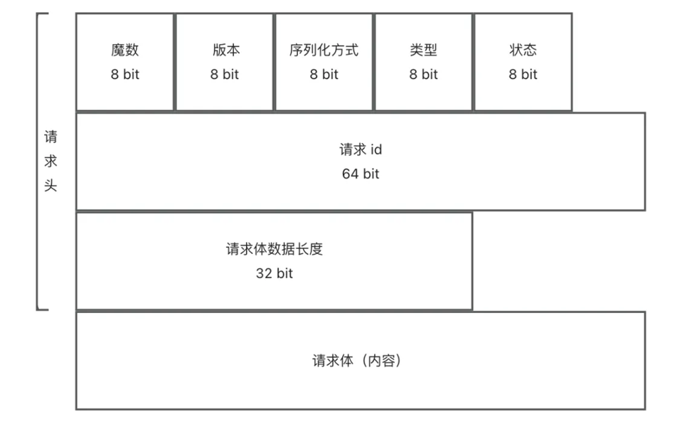

# my-rpc

从 0 到 1 开发简易版的 RPC 框架，持续扩展优化 ......

***概念:*** RPC（Remote Procedure Call）即远程过程调用，是一种计算机通信协议，它允许程序在不同的计算机之间进行通信和交互，就像本地调用一样。

***应用:*** RPC 允许一个程序（称为服务消费者）像调用自己程序的方法一样，调用另一个程序（称为服务提供者）的接口，而不需要了解数据的传输处理过程、底层网络通信的细节等。这些都会由 RPC 框架帮你完成，使得开发者可以轻松调用远程服务，快速开发分布式系统。

***架构设计图:***

***拓展:***
- [x] 全局配置加载（允许引入框架的项目通过编写配置文件实现**自定义配置**）

- [x] 接口 Mock（支持mock服务，为调用的服务**创建模拟对象**，跑通业务流程——

- [x] **SPI机制**（实现模块化开发和插件化拓展）

- [x] 框架支持多种序列化器（Jdk,Json,Kryo,Hessian）和自定义序列化器（实现接口，修改配置文件，通过SPI机制引入）

- [x] **注册中心**基础（基于**Etcd**实现注册中心 数据分布式存储，服务注册，服务发现，服务注销）

  ***注册中心基本流程：***
  

- [x] 注册中心优化（增加心跳检测和续期机制，服务节点下线机制，消费端服务缓存），增加基于**ZooKeeper**实现注册中心和自定义注册中心（实现接口，修改配置文件，通过SPI机制引入）

  ***注册中心监听机制，服务缓存更新：***
  

- [x] 自定义 RPC 协议（自定义网络传输，自定义消息结构）

  1. **网络传输设计**：

     网络传输设计的目标是：选择一个能够高性能通信的网络协议和传输方式。

     RPC框架比较注重性能，HTTP协议的头信息是比较大的，会影响传输性能。但其实除了这点外，HTTP本身属于无状态协议，这意味着每个HTTP请求都是独立的，每次请求/响应都要重新建立关闭连接，也会影响性能。考虑到这点，在HTTP/1.1中引入了持久连接(Keep-Alive),允许在单个TCP连接上发送多个HTTP请求和响应，避免了每次请求都要重新建立和关闭连接的开销。

     虽然如此，HTTP本身是应用层议，设计的RPC协议也是应用层协议，性能肯定是不如底层（传输层）的TCP协议要高的。所以为了追求更高的性能，选择使用**TCP协议**成网络传输，有更多的自主设计空间。

  2. **消息结构设计**：

     消息结构设计的目标是：用最少的空间传递需要的信息。

     消息结构组成：

     1）魔数：作用是安全校验，防止服务器处理了非框架发来的无关消息（类似 HTTPS 的安全证书）

     2）版本号：保证请求和响应的一致性（类似 HTTP 协议有 1.0/2.0 等版本）

     3）序列化方式：告知服务端和客户端如何解析数据（类似 HTTP 的 Content-Type 内容类型）

     4）类型：标识消息是请求还是响应或者是心跳检测等其他用途。（类似 HTTP 有请求头和响应头）

     5）状态：如果是响应，记录响应的结果（类似 HTTP 的 200 状态代码）

     6）请求 id：唯一标识某个请求，因为 TCP 是双向通信的，需要有个唯一标识来追踪每个请求。

     7）请求体数据长度: 保证能够完整地获取消息体数据（因为 TCP 协议是一个流式协议，多次发送的数据在可能接收时被合并为一个数据块，会存在半包和粘包问题，每次传输的数据可能是不完整的）。

     ***消息结构设计：***

     

  3. 其他：

     1）Vert.X的TCP服务器收发的消息是Buffer类型，不能直接写入一个对象。引入自定义**消息编码器和解码器**，将Java消息对象和Buffer相互转换。

     ***引入编码器和解码器的流程图：***

     

     2） Vert.X 内置的 `RecordParse` 可以保证读取到**特点长度**字符串，采用**装饰者模式**，使用 RecordParse 对 Buffer 处理器增强，解决**半包和粘包**问题。

- [x] 框架支持**负载均衡**（提供的负载均衡算法：**轮询、随机、一致性哈希**）和自定义负载均衡器（实现接口，修改配置文件，通过SPI机制引入），消费者可根据配置的的负载均衡器，选择服务发起请求。
- [x] 框架支持**重试机制**（提供的重试策略：**不重试、固定时间间隔重试、指数退避重试、斐波那契时间间隔重试、随机延迟重试、复合等待时间间隔重试**）和自定义重试器（实现接口，修改配置文件，通过SPI机制引入）